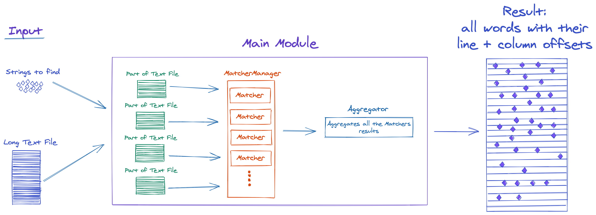

# TextFinder

Java program to find specific strings in a large text.

Inputs:
1. Large text file
2. List of words to find

Main Module:
1. Reads the large text file and divide it into parts.
2. Each part of the file "goes" into the `MatcherManger` which creates new `Matcher`. Each `Mathcer` starts to search on a **separate THREAD**.
3. After all of the `Matcher`s finished, the `Aggregator` "sum up" all the words and their locations on the large file.

Output:
- Collection of found *words*, and for each word, its line offset and column offset
 

## Running the project
The project is built by the [Gradle Build Tool](https://gradle.org).

Just run the command: `gradle run` 😀